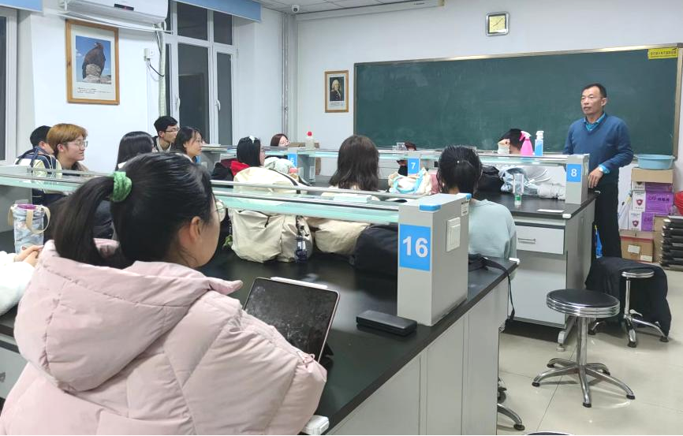

<!-- ---
sidebar: auto
sidebarDepth: 3
--- -->

# iGEM实验室安全培训

## 段落1

​	2023年3月4日，国际基因工程机器大赛（iGEM）CAU_China 2023团队正式组建，并召开了第一次成员见面会。

## 段落2

​	在本次见面会上，生物学院的王宝青老师对各位成员进行了安全培训，生动细致地讲解了实验室的各项安全问题与注意事项。

## 段落3

​	俗话说，水火无情，实验室的消防安全是我们最应重视的问题，稍有不慎便会造成严重的经济损失，甚至威胁每位同学的生命安全。王宝青老师用举例的方式向我们传达了实验室防火的重要性，同时也传授了很多应急救火的方法，并现场演示了灭火毯的使用流程。

## 段落4

​	在实验室用电安全方面，王宝青老师强调：不可随意扩充或串联插线板来接通仪器或其他电子设备，以免超过额定功率，发生触电、起火等事故。

## 段落5

​	除此以外，王宝青老师还介绍了实验室常见装置（包括超低温冰箱、洗眼器等）的使用注意事项，并强调了危险试剂的保存、使用方法。

## 段落6

​	总而言之，在进行实验的过程中，我们不仅要熟知各项安全规章，还要对潜在的风险进行预判，切不可粗心大意、盲目冒险。同时，作为本科生，我们还应养成良好的习惯，为自己和同伴打造一个整洁有序、卫生舒适的实验室工作环境！

## 段落7

​	在本次活动中，CAU_China的各位成员受益匪浅，相信我们的团队一定会牢记王宝青老师的耐心指导与教诲，在2023年iGEM中再创辉煌！

### 11
文案/刘祥骏

图片/董羽扬

排版/

审校/